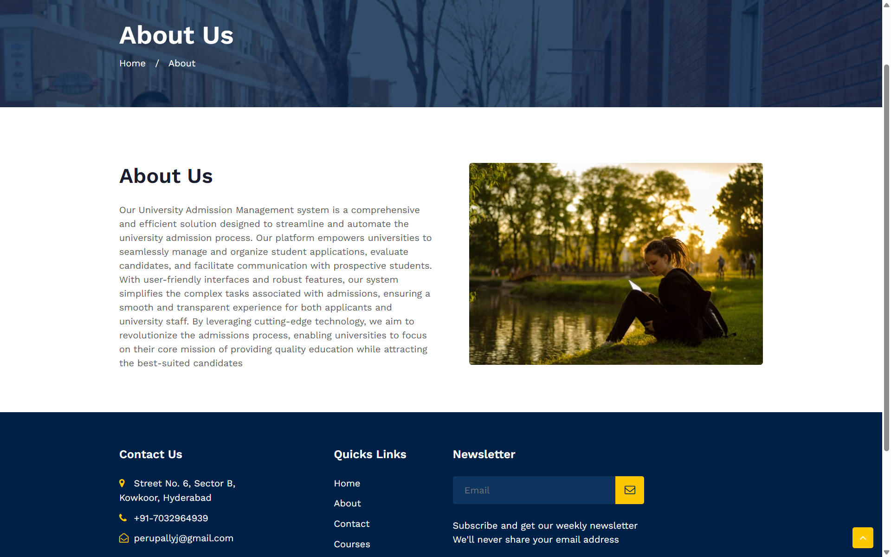
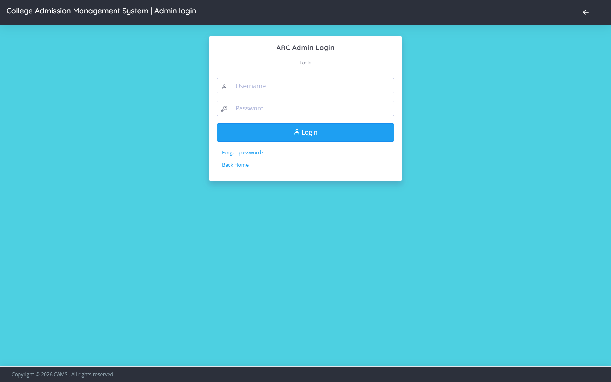
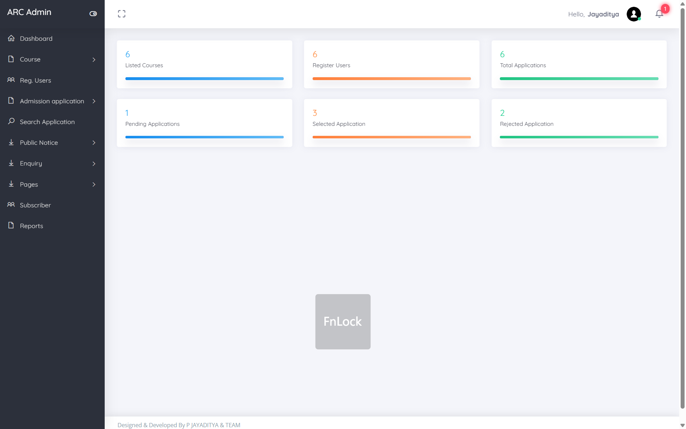
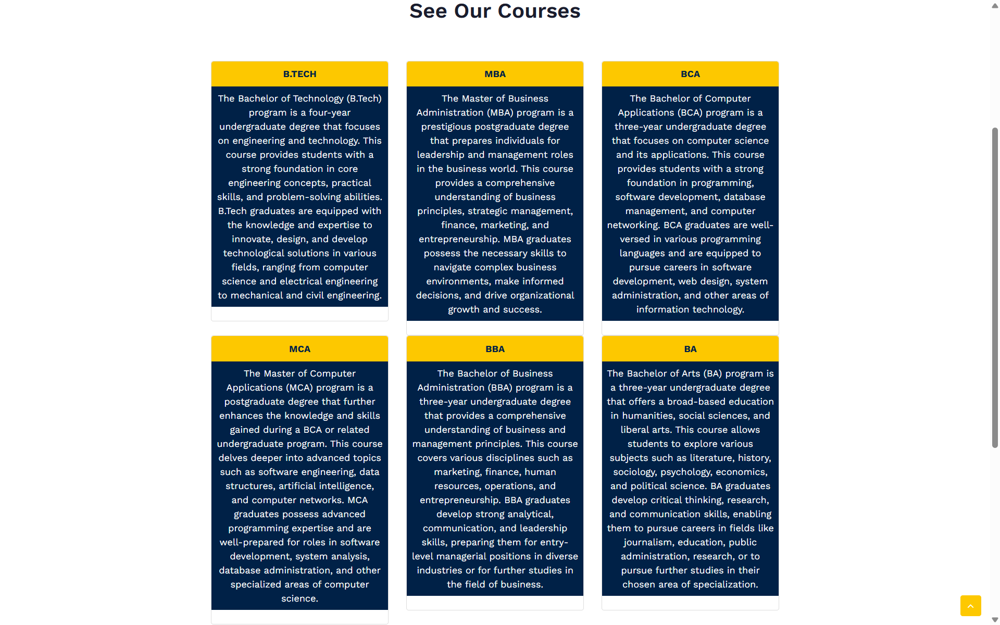
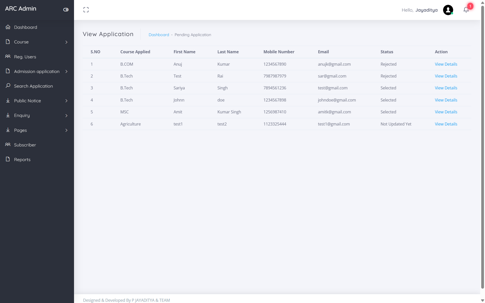
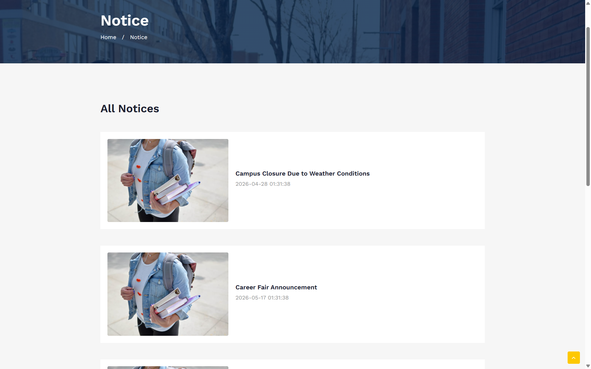
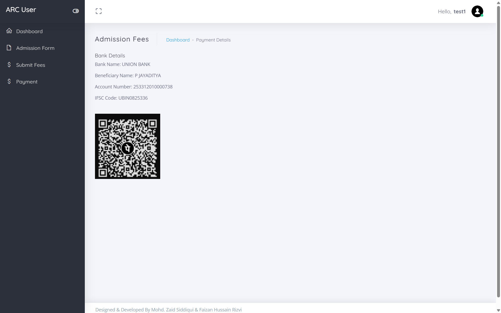
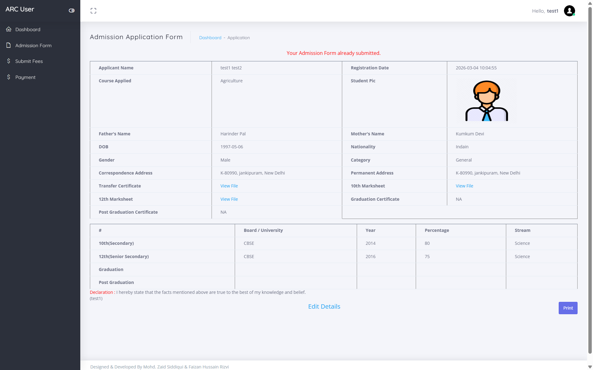
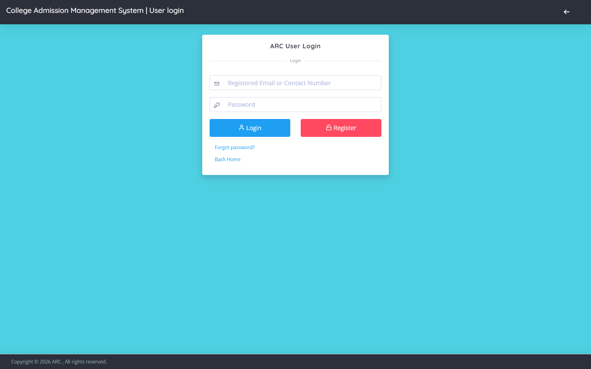

# 🎓 Advanced Admission Registration Console (ARC)

<p align="center">
  <b>Simplifying and Digitizing the College Admission Process</b>
</p>

---

## 📌 Overview

The **Advanced Admission Registration Console (ARC)** is a web-based application developed to automate and streamline the college admission process. It provides a centralized platform for managing student registrations, course applications, fee payments, and administrative operations efficiently.

---

## 🚀 Features

### 👨‍💼 Admin Module

* Secure Admin Login
* Dashboard with system statistics
* Course Management
* Application Review & Approval
* Notice Board Management
* User Management

---

### 👨‍🎓 Student Module

* Registration & Login
* Admission Form Submission
* Course Selection
* Document Upload
* Fee Payment
* Profile & Status Tracking

---

## 🛠️ Tech Stack

* **Frontend:** HTML, CSS, Bootstrap, JavaScript
* **Backend:** PHP
* **Database:** MySQL
* **Server:** Apache (XAMPP)

---

## ⚙️ How to Run

1. Install XAMPP
2. Move project to:

   ```
   C:\xampp\htdocs\
   ```
3. Start Apache & MySQL
4. Create database:

   ```
   camsdb
   ```
5. Import SQL file
6. Run:

   ```
   http://localhost/cams
   ```

---

## 🔐 Admin Credentials

| Username | Password |
| -------- | -------- |
| Jay      | Test@123 |

---

## 📸 Screenshots

### 🏠 Home Page

<p align="center">
  
</p>

---

### 🔐 Admin Login

<p align="center">
  
</p>

---

### 📊 Admin Dashboard

<p align="center">
  
</p>

---

### 📚 Courses

<p align="center">
  
</p>

---

### 📝 Applications

<p align="center">
  
</p>

---

### 📢 Notice Board

<p align="center">
  
</p>

---

### 💳 Fee Payment

<p align="center">
  
</p>

---

### 🧾 Admission Form

<p align="center">
  
</p>

---

### 👨‍🎓 User Dashboard

<p align="center">
  
</p>

---

### 👤 User Login

<p align="center">
  
</p>

---

## 📂 Project Structure

```
cams/
├── admin/
├── user/
├── includes/
├── assets/
├── SS/
└── index.php
```

---

## 🔒 Security

* Password encryption (MD5)
* Input validation
* Secure database connection

---

## 🚀 Future Enhancements

* Payment gateway integration
* Email/SMS notifications
* OTP-based login
* Responsive UI improvements

---

## 👨‍💻 Author

**Jayaditya**
GitHub: https://github.com/JAYADITYA-2006

---

## ⭐ Support

If you like this project, give it a ⭐ on GitHub!
